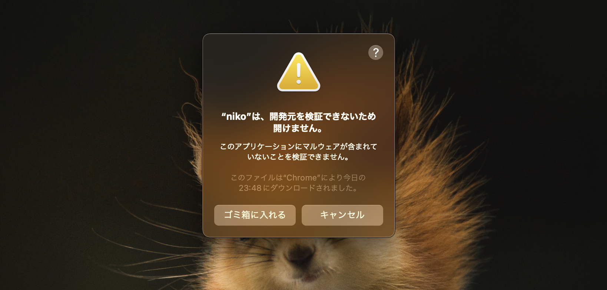
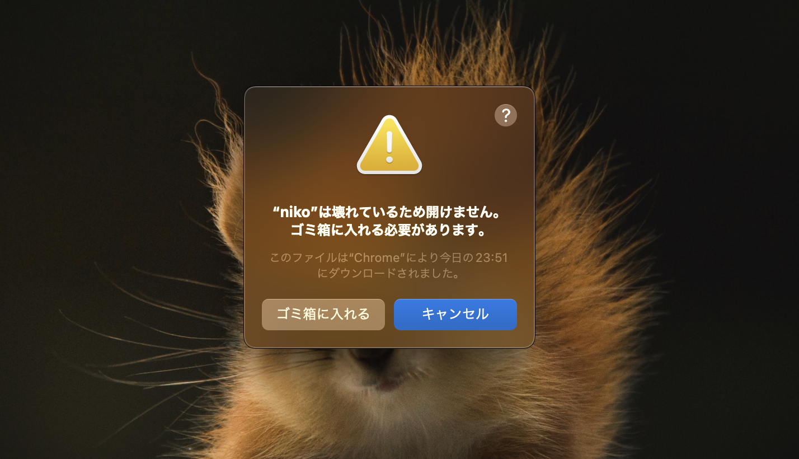

## installation

you can install from releases - https://github.com/fox-plt/niko-docs/releases

niko require Session Manager plugin, install it from [here](https://docs.aws.amazon.com/systems-manager/latest/userguide/session-manager-working-with-install-plugin.html)

## FAQ

### cannot be verified(検証できない)



日本語参考: https://support.apple.com/ja-jp/guide/mac-help/mh40616/mac

english reference: https://support.apple.com/en-us/HT202491

### niko is damaged(壊れている)



exec below command

```
xattr -rc /Applications/niko.app
``````

`xattr -rc` be disabling the use of the "com.apple.quarantine" extended attribute
