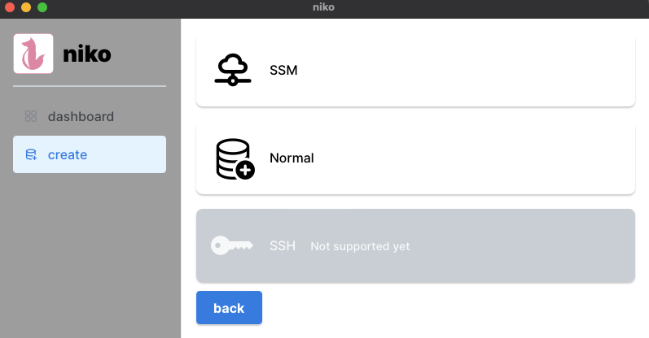
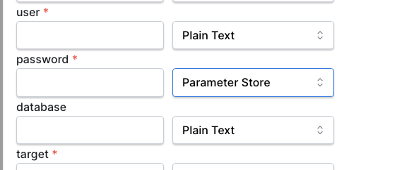

# niko

niko is Database GUI Client specialized AWS.

## feature

- Connect to Database using SSM

- Read value from Parameter Store

## support OS

- macos (main support)
    - apple silicon
    - Intel
- linux (only builds, not tested)
- windows (not supported yet)

## available

Only a beta version is available now. Updates may contain breaking changes.

## installation

[installation](./.doc/installation.md)
